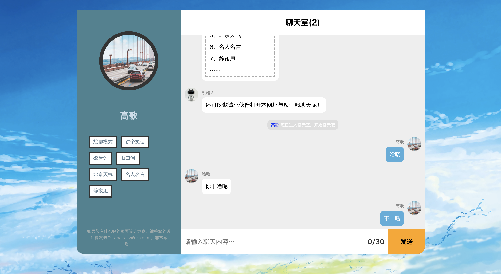

# TChat 2.0

### 项目描述

一个基于Node服务的在线聊天室。

## 背景

使用 `Vue 3` 重构 [TChat 1.0](node/TChat)，熟悉 `Vue3`、`Vite` 等框架和工具的开发和应用。

#### 已实现

- [x] 在线聊天
- [x] 统计在线人数
- [x] 加入群聊、退出群聊提醒
- [x] 支持快捷消息发送
- [x] 优化输入昵称的交互

#### TODO

- [ ] 自动分配头像和昵称
- [ ] 页面重构，多端适配
- [ ] 引入AI自动回复机器人，增加可交互性
- [ ] 引入音乐播放器，在一个愉快地氛围里聊天
- [ ] ……

### 技术栈

#### 前端

+ `Vue 3`: 新增 `Composition API`
+ `vue-router 4`: The official router for Vue.js. @4支持 `Vue 3`
+ `Vite`: 下一代前端开发与构建工具
+ `Typescript`: 类型约束
+ `socket.io-client`: `socket.io` 的客户端版本
+ `sass`: css预编译处理器

#### 后端

+ `Node`: 基础服务搭建
+ `Typescript`: 类型约束
+ `socket.io`: 建立socket链接
+ `ts-node`: 支持编译Typescript
+ `tsconfig-paths`: 支持ts路径别名，如@
+ `nodemon`: 热更新和重启node服务

### 项目地址

前端
[TChat-vue](https://github.com/AWhiteMouse/TChat-vue)

后端
[TChat-node](https://github.com/AWhiteMouse/TChat-node)

### 效果预览

